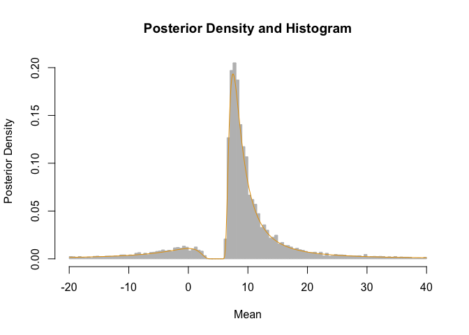

<!-- README.md is generated from README.Rmd. Please edit that file -->

# nisone

<!-- badges: start -->

[](https://github.com/dcgerard/nisone/actions/workflows/R-CMD-check.yaml)
[](https://codecov.io/gh/dcgerard/nisone)
[](https://www.gnu.org/licenses/gpl-3.0)
<!-- badges: end -->

Provides different interval estimates of a location parameter when the
sample size is one or more. These include classical methods when n=1,
new Bayesian analogues of these classical methods, and extensions of
these methods to larger sample sizes in the normal case. Other functions
calculate Bayes factors based on t-statistics, and implement the
(generalized) inverse normal distribution (and other inverse
distributions). See Gerard (2026) for details of these methods.

## Installation

You can install the development version of nisone from
[GitHub](https://github.com/dcgerard/nisone) with:

``` r
# install.packages("pak")
pak::pak("dcgerard/nisone", build_vignettes = TRUE)
```

# n=1 confidence interval

If we observe $X = 10$ and we have prior guess that the mean is around
5, then the resulting 95% CI based on a normal model is

``` r
library(nisone)
ci1(x = 10, A = 5)
#>       x center  lower upper
#> [1,] 10    7.5 -40.76 55.76
```

Its full posterior distribution based on a probability matching prior
can be calculated using the `n1post` family of functions. For example,
the median and 95% credible interval is

``` r
qn1post(p = c(0.025, 0.5, 0.975), A = 5, obs = 10, nu = 1, fam = "normal")
#> [1] -40.755   8.549  55.773
```

Some random posterior draws and density curve is

``` r
samp <- rn1post(n = 10000, A = 5, obs = 10, nu = 1, fam = "normal")
samp <- samp[samp > -20 & samp < 40]
x <- seq(-20, 40, length.out = 500)
y <- dn1post(x = x, A = 5, obs = 10, nu = 1, fam = "normal")
graphics::hist(
  samp, 
  freq = FALSE, 
  breaks = 200, 
  border = "grey", 
  col = "grey",
  main = "Posterior Density and Histogram",
  xlab = "Mean",
  ylab = "Posterior Density"
)
graphics::lines(x, y, type = "l", col = "#E69F00")
```



If we just want to assume that $X$ comes from *any* symmetric unimodal
distribution, a 95% CI for the mode is

``` r
ci1(x = 10, A = 5, family = "uniform")
#>       x center  lower upper
#> [1,] 10    7.5 -87.43 102.4
```

See more functionality by running

``` r
browseVignettes("nisone")
```

# References

- Gerard, D. (2026). Constructing and extending *n* = 1 Bayesian
  confidence intervals for location parameters in location-scale
  families. *arXiv Preprint*.
  [doi:10.48550/arXiv.2607.25007](https://doi.org/10.48550/arXiv.2607.25007)
