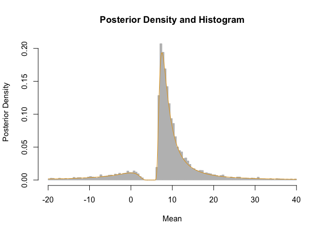

# nisone

Provides different interval estimates of a location parameter when the
sample size is one or more. These include classical methods when n=1,
new Bayesian analogues of these classical methods, and extensions of
these methods to larger sample sizes in the normal case. Other functions
calculate Bayes factors based on t-statistics, and implement the
(generalized) inverse normal distribution (and other inverse
distributions). See Gerard (2026) for details of these methods.

## Installation

You can install the development version of nisone from
[GitHub](https://github.com/dcgerard/nisone) with:

`# install.packages("pak")`` ``pak``::`[`pak`](https://pak.r-lib.org/reference/pak.html)`(``"dcgerard/nisone"``, build_vignettes ``=`` ``TRUE``)`

# n=1 confidence interval

If we observe \\X = 10\\ and we have prior guess that the mean is around
5, then the resulting 95% CI based on a normal model is

[`library`](https://rdrr.io/r/base/library.html)`(`[`nisone`](https://dcgerard.github.io/nisone/)`)`` `[`ci1`](https://dcgerard.github.io/nisone/reference/ci1.md)`(``x ``=`` ``10``, A ``=`` ``5``)`` ``#> x center lower upper`` ``#> [1,] 10 7.5 -40.76 55.76`

Its full posterior distribution based on a probability matching prior
can be calculated using the `n1post` family of functions. For example,
the median and 95% credible interval is

[`qn1post`](https://dcgerard.github.io/nisone/reference/n1post.md)`(``p ``=`` `[`c`](https://rdrr.io/r/base/c.html)`(``0.025``, ``0.5``, ``0.975``)``, A ``=`` ``5``, obs ``=`` ``10``, nu ``=`` ``1``, fam ``=`` ``"normal"``)`` ``#> [1] -40.755 8.549 55.773`

Some random posterior draws and density curve is

`samp`` ``<-`` `[`rn1post`](https://dcgerard.github.io/nisone/reference/n1post.md)`(``n ``=`` ``10000``, A ``=`` ``5``, obs ``=`` ``10``, nu ``=`` ``1``, fam ``=`` ``"normal"``)`` ``samp`` ``<-`` ``samp``[``samp`` ``>`` ``-``20`` ``&`` ``samp`` ``<`` ``40``]`` ``x`` ``<-`` `[`seq`](https://rdrr.io/r/base/seq.html)`(``-``20``, ``40``, length.out ``=`` ``500``)`` ``y`` ``<-`` `[`dn1post`](https://dcgerard.github.io/nisone/reference/n1post.md)`(``x ``=`` ``x``, A ``=`` ``5``, obs ``=`` ``10``, nu ``=`` ``1``, fam ``=`` ``"normal"``)`` ``graphics``::`[`hist`](https://rdrr.io/r/graphics/hist.html)`(`` `` ``samp``, `` `` freq ``=`` ``FALSE``, `` `` breaks ``=`` ``200``, `` `` border ``=`` ``"grey"``, `` `` col ``=`` ``"grey"``,`` `` main ``=`` ``"Posterior Density and Histogram"``,`` `` xlab ``=`` ``"Mean"``,`` `` ylab ``=`` ``"Posterior Density"`` ``)`` ``graphics``::`[`lines`](https://rdrr.io/r/graphics/lines.html)`(``x``, ``y``, type ``=`` ``"l"``, col ``=`` ``"#E69F00"``)`

If we just want to assume that \\X\\ comes from *any* symmetric unimodal
distribution, a 95% CI for the mode is

[`ci1`](https://dcgerard.github.io/nisone/reference/ci1.md)`(``x ``=`` ``10``, A ``=`` ``5``, family ``=`` ``"uniform"``)`` ``#> x center lower upper`` ``#> [1,] 10 7.5 -87.43 102.4`

See more functionality by running

[`browseVignettes`](https://rdrr.io/r/utils/browseVignettes.html)`(``"nisone"``)`

# References

- Gerard, D. (2026). Constructing and extending *n* = 1 Bayesian
  confidence intervals for location parameters in location-scale
  families. *In preparation*.
